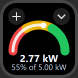
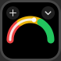
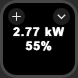
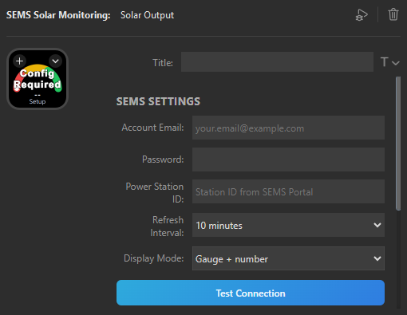

# SEMS Solar Monitoring for Stream Deck

A Stream Deck plugin that displays live solar generation data from GoodWe inverters via the [SEMS Portal](https://www.semsportal.com) REST API. Monitor your solar PV system's real-time output on your Elgato Stream Deck.


## Images

Example of display options

| Gauge with Numbers                                       | Gauge                           | Numbers                             |
| -------------------------------------------------------- | ------------------------------- | ----------------------------------- |
|  |  |  |

Authentication and settings



## Features

- **Live Power Output**: Real-time display of current AC power generation (watts)
- **Daily Statistics**: Track today's energy production (kWh)
- **Lifetime Totals**: View cumulative energy generation (kWh)
- **Capacity Monitoring**: Display system capacity and current output percentage
- **Auto-Refresh**: Configurable polling interval (default: 10 minutes)
- **Error Handling**: Graceful handling of API failures and network issues

## Prerequisites

- **Elgato Stream Deck**: Software version 6.9 or higher
- **Operating System**:
  - Windows 10 or higher
  - macOS 12 or higher
- **Node.js**: Version 20 or higher
- **GoodWe SEMS Account**: Valid credentials from [semsportal.com](https://www.semsportal.com)
- **Power Station ID**: Your GoodWe power station identifier

## Installation

### For Users

1. Download the latest `.streamDeckPlugin` file from the [Releases](../../releases) page
2. Double-click the file to install it in Stream Deck
3. Drag the "Solar Output" action to a key on your Stream Deck
4. Configure your SEMS credentials in the Property Inspector:
   - Email (account)
   - Password
   - Power Station ID

### For Developers

See [Building from Source](#building-from-source) below.

## Configuration

After adding the action to your Stream Deck:

1. **Click the action** to open the Property Inspector
2. **Enter your SEMS Portal credentials**:
   - **Email**: Your SEMS Portal account email
   - **Password**: Your SEMS Portal password
   - **Power Station ID**: Found in the SEMS Portal URL or app
3. **Adjust refresh interval** (optional): Set how often to poll the API (minimum 60 seconds recommended)

> ⚠️ **Security Note**: Credentials are stored in Stream Deck's settings. Never commit credentials to version control.

## Building from Source

### Setup

1. **Clone the repository**:

   ```bash
   git clone https://github.com/yourusername/streamdeck-plugin-sems.git
   cd streamdeck-plugin-sems
   ```

2. **Install dependencies**:

   ```bash
   npm install
   ```

3. **Install Elgato CLI** (if not already installed):

   ```bash
   npm install -g @elgato/cli
   ```

### Build Commands

- **Production Build**:

  ```bash
  npm run build
  ```

  Compiles TypeScript to JavaScript and bundles the plugin into `dev.neave.sems.solar.monitoring.sdPlugin/bin/plugin.js`

- **Development Watch Mode**:

  ```bash
  npm run watch
  ```

  Automatically rebuilds on file changes and restarts the plugin in Stream Deck

### Development Workflow

1. **Start watch mode**:

   ```bash
   npm run watch
   ```

2. **Link the plugin** (first time only):

   ```bash
   streamdeck link dev.neave.sems.solar.monitoring.sdPlugin
   ```

3. **Make changes** to TypeScript files in `src/`
4. **Watch the build output** — Rollup will recompile automatically
5. **Stream Deck will restart the plugin** after each build
6. **Check logs** in `dev.neave.sems.solar.monitoring.sdPlugin/logs/`

### Project Structure

```text
streamdeck-plugin-sems/
├── src/                          # TypeScript source code
│   ├── plugin.ts                 # Plugin entry point
│   └── actions/
│       └── sems-solar-output.ts # Main action implementation
├── dev.neave.sems.solar.monitoring.sdPlugin/ # Plugin bundle
│   ├── manifest.json             # Plugin metadata
│   ├── bin/                      # Compiled JavaScript
│   ├── imgs/                     # Icons and images
│   ├── logs/                     # Runtime logs
│   └── ui/                       # Property Inspector UI
│       ├── sems-solar-output.html
│       ├── sems-solar-output.js
│       └── styles.css
├── package.json                  # npm configuration
├── tsconfig.json                 # TypeScript configuration
├── rollup.config.mjs             # Rollup bundler configuration
└── README.md                     # This file
```

## Contributing

We welcome contributions! Please see [CONTRIBUTING.md](CONTRIBUTING.md) for detailed guidelines on:

- Reporting issues
- Submitting pull requests
- Code standards
- Testing checklist
- Development tips

## API Reference

The plugin uses the GoodWe SEMS Portal API v3:

### Authentication Flow

1. **Login**: `POST https://www.semsportal.com/api/v1/Common/CrossLogin`
2. **Get Data**: `POST {regionUrl}/v3/PowerStation/GetMonitorDetailByPowerstationId`

See `.github/copilot-instructions.md` for detailed API documentation.

## Troubleshooting

### Plugin doesn't appear in Stream Deck

- Verify Node.js 20 is installed: `node --version`
- Check Stream Deck version is 6.9+
- Restart Stream Deck application

### Authentication fails

- Verify credentials in SEMS Portal web interface
- Check for region-specific API URLs (au, eu, us, etc.)
- Review logs in plugin's `logs/` directory

### Data not updating

- Verify power station is online in SEMS Portal
- Check refresh interval isn't too high
- Ensure API rate limits aren't exceeded

## License

This project is licensed under the MIT License - see the [LICENSE](LICENSE) file for details

## Credits

- **Stream Deck SDK**: [Elgato](https://github.com/elgatosf/streamdeck)
- **SEMS Portal API**: [GoodWe](https://www.semsportal.com)

## Related Links

- [Stream Deck SDK Documentation](https://docs.elgato.com/streamdeck/sdk/)
- [GoodWe SEMS Portal](https://www.semsportal.com)
- [Binod Karunanayake's API Guide](https://binodmx.medium.com/accessing-the-goodwe-sems-portal-api-a-comprehensive-guide-296e0431c285)
- [Elgato Stream Deck](https://www.elgato.com/stream-deck)

---

**Disclaimer**: This plugin is not officially affiliated with or endorsed by GoodWe or Elgato. Use at your own risk.
